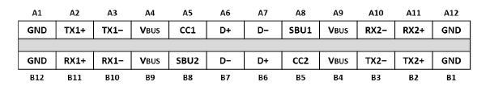
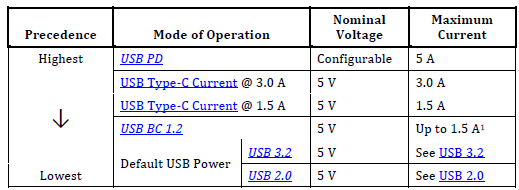
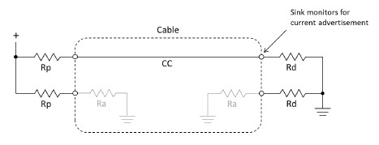
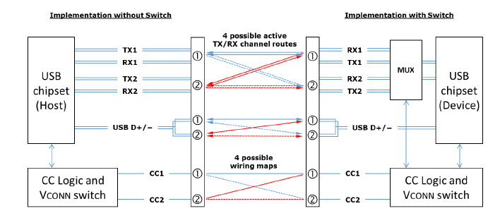
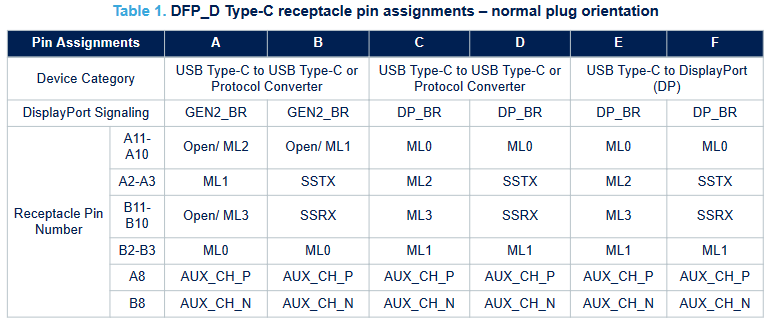

# Chapter 1 - USB Type-C Introduction

USB Type-C is a cable and connector specification to enable new hosts and devices with more functions at a higher speed. It is compatible with existing USB hosts and devices. With the USB Type-C connector plug orientation doesn't matter.

This summary only covers the parts which are used on enclustras PE3 board.

## 1.1 Terminology

| Term | Description |
| ------ | ------ |
| Source | Port providing power, most commonly a Host or Hub (DFP) |
| Sink | Port consuming power, most commonly a Device |
| DRP | Dual-Role-Power, port that can operate as either a Source or a Sink |
| UFP | Upstream Facing Port (flow of data), the port on a device or a hub that connects to a host or a DFP |
| DFP | Downstream Facing Port (flow of data), host |
| DRD | Port that can be DFP or UFP |
| Active cable | Cable with repeaters in the USB 3.2 datapath |
| Electronically Marked Cable | USB Type-C cable with a marker (chip) that provides the cables characteristics over USB PD communication. |
| Type-C Plug | For example USB stick |
| Type-C Receptacle | Opposite of plug |
| EMCA | Electronically Marked Cable Assembly |

## 1.2 USB Connectors

In this section, information about USB cables and plugs are mentioned.

### 1.2.1 USB Plugs

| Pin/Signal | Description |
| ------ | ------ |
| GND | Ground |
| VBUS | Bus Power |
| TX | High Speed Data Path TX |
| RX | High Speed Data Path RX |
| D+/D- | USB 2.0 Interface |
| CC | Communication Channel |
| SBU | Sideband Use, not used for USB, DP AUX for DP Alt Mode |

### 1.2.2 USB Cables

#### 1.2.2.1 eMarker

An eMarker is a chip in an electronically marked cable assembly that returns information about the cable over USB PowerDelivery. \

Information includes:

- Product/Vendor
- Cable connectors
- Supported USB protocol
- Use of VCONN
- Available VBUS current

#### 1.2.2.2 CC signals

CC1-signal is directly wired in the cable to support detection of cable flip and power delivery communication. \
CC2-signal can be used as VCONN to power the marker chip in the cable.

#### 1.2.2.3 Defined cable assemblies
There are multiple cable assemblies defined:

- Full-Featured USB Type-C Cable Assembly: a cable with all data and power wires including an eMarker. The cable length depends on supported datarate and cable shielding. Common cables are 1-2m in maximum.
- Active cables are similar to full-featured cables but with repeaters on the TX/RX signals, cable length can be increased to 5m. They should work like passive cables from  users perspective.
- Optically Isolated Active Cables (OIACs) support up to 50m and provide electrical isolation. They may only work with USB 3.2 compliant devices
- USB 2.0 Type-C Cable Assembly: a cable with only USB 2.0 data, power/GND and CC wires. These cables can go up to 5m.
- Captive cables are cables that have a USB Type-C plug on one end and are hardwired and not detachable from the device on the other hand
- Legacy cables are assemblies to enable interoperability between USB Type-C and legacy USB products (USB A, USB B). Warning: Not all combinations are possible. Check in individual case

## 1.3 Power
There are multiple power definitions in USB 2.0, USB 3.2, USB BC 1.2, USB Type-C and USB Power Delivery specification that may be supported on USB Type-C. \

### 1.3.1 USB Type-C Current
All USB Type-C devices shall support USB Type-C current. The source advertises the amount of current it can supply using pullup-resistors or a current source. The sink has a fixed 5.1kOhm pulldown to detect the supported currents. \

| Source Advertisement | Pull-up R to 5V | Datarate | Advertised Current |
| ------ | ------ | ------ | ------ |
| Default USB Power | 56kOhm | USB 2.0 | 500mA |
| Default USB Power | 56kOhm | USB 3.2 single-lane | 900mA |
| Default USB Power | 56kOhm | USB 3.2 dual-lane | 1.5A |
| 1.5A | 22kOhm | any | 1.5A |
| 3A | 10kOhm | any | 3.0A |

### 1.3.2 Power Delivery
Using the USB Power Delivery protocol allows negotiation of up to 240W power (48V/5A) with extended power range. USB Power Delivery protocol uses one of the CC lines as a data channel to negotiate avaiable power.\
USB Type-C cables has to support up to 3A/20V. To exceed this, the cable has to contain an eMarker.\

Additional usage of power delivery:

- Change power role, switch between sink and source
- Change data role, switch UFP and DFP
- Select an alternate mode
- Exchange battery information
- Get information from EMCA cables

## 1.4 Specialities

### 1.4.1 VCONN

The CC pin which is not used for power delivery is used by VCONN. VCONN powers the electronically marked cable (eMarker) and is initially supplied by the power source.

### 1.4.2 Data

Data transmission is defined in USB 2.0, USB 3.2 and USB4 standards.

### 1.4.3 Plug rotation (flip)

The USB Type-C connector can be plug in in both ways upside-up and upside-down. For that reason the USB Type-C controller switches/multiplexes the lines to the correct pins.

USB 2.0 data connection is done using the D+/D- pins. The two D+ signal pins and the two D- signal pins are shorted together in the host and device receptacles to support the cable flipping.

USB 3.2 and USB4 allows lane speeds of up to 20Gbit/s using the RX and TX lanes. Using the CC wire in the cable allows the host and device to route the TX/RX signals.

## 1.5 Alternate Modes
USB Type-C supports alternate modes where some wires are dedicated for transmission of direct alternate data protocols such as DisplayPort, HDMI or Thunderbolt.\
Alternate modes are negotiaded over power delivery communication between host and sink.

### 1.5.1 DisplayPort

In the DisplayPort alternate mode the sideband wires are used for DP AUX signals. Depending on the configuration all RX and TX wires can be used for DP resulting in a 4 lane DP. IN case of 4 lane DP, USB 3.2 is no longer possible.

## 1.6 Mercury+ PE3

Mercury+ PE3 uses a TI TPS65987DDHRSHR USB Type-C Controller. This chip handles the power delivery communication for power negotiation, USB mode and alternate modes. It also configures the multiplexers according to cable flip. Notification events has to be configured such as power role/data role swap and plug events. \
The configuration can be created with Ti tool USB_C_Application_Customization_Tool. For further information look at the ti website [link](https://www.ti.com/tool/TPS6598X-CONFIG).

**The next chapter of this application note is [Chapter 2 - TPS6598x Example Config](./Chapter-2-TPS_Example_Config.md).**
