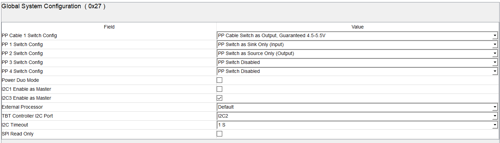
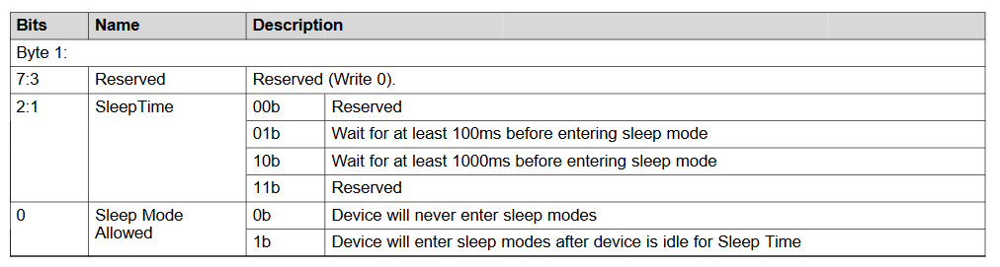

# Chapter 2 - TPS6598x Example Config

In this section an example configuration for Mercury+ PE3 Board is described.

The configuration is done via the application customization tool from ti in the version 6.1.2. Please refer to the documentation of the tool at ti's website [link](https://www.ti.com/tool/TPS6598X-CONFIG)

The TPS65987D device is a stand-alone USB Type-C and Power Delivery (PD) controller providing cable plug and orientation detection for a single USB Type-C connector. For nearly every detection, an event can be placed in the configuration. Upon cable detection, the TPS65987D communicates on the CC wire using the USB PD protocol. When cable detection and USB PD negotiation are complete, the TPS65987D enables the appropriate power path and configures alternate mode settings for external multiplexers.

## 2.1 General settings

To configure the TPS6598x device ti's "Application Customization Tool" in the Version 6.1.2 ís used. Please mark, if a different version is used, the configuration file may be load incorrect.

On the MainPage of the window a customer version can be set. In this case `0x00` is used as a default value. The other values are also left as default.

```
I2C_ADDR = 0 (R1/R2 0 0.00-0.18)
```

This leads to i2c device addresses `0x20` and `0x38`.

To configure further features, `Port Settings` has to be selected on the tabs view.


## 2.2 Port Settings

### 2.2.1 Customer Use (0x06)

Default values for Word1 and Word2 are used in the section (`0x0`).

### 2.2.2 Interrupt Mask for I2C (0x16 / 0x17)

The device has two I2C ports. The first port can be a master or a slave, but the default behavior is to be a slave. The second port operates as a slave only. Port 1 and Port 2 are interchangeable as slaves. Both Port1 and Port2 operate in the same way and
has the same access in and out of the core. An interrupt mask is set for each that determines what events are
interrupted on that given port. [\[ref\]](https://www.ti.com/lit/gpn/tps65987d)

The provided configuration enabels interrupts on "Plug Insert or Removal" - event.

The same configuration is also used for the second I2C Port `I2C2`.

### 2.2.3 Global System Configuration (0x27)

In this overview some general settings are made. PP (Power Path) as well as power master selection and timeouts.



In this case, the default values can be used.

### 2.2.4 Port Configuration (0x28)

These fields can be left as default in the PE3 example configuration. For further information please refer to  ti documents listet above.

### 2.2.5 Port Control (0x29)

This register `0x29` "Port Control" is left as default. The provided current can be set in the field. 3A can be selected.

### 2.2.6 Transmit Source Capabilities (0x32)

Values left as default. Restrict source is not necessary.

### 2.2.7 Transmit Sink Capabilities (0x33)

These values can be left as default. The sink should be limited to 5V/3A up to maximum 9V. In the default configuration these values are respected.

### 2.2.9 Autonegotiate Sink (0x37)

Autonegotie Sink can be enabled be checking the box. The following picture shoes the values which are configured in the provided file.


### 2.2.10 PD3 Configuration Register (0x42)

Power Delivery Protocol is supported in the newest version 3.0. For further information regarding power delivery standards please refer to [link](https://www.ti.com/lit/pdf/slva888). The registers in the provided example configuration are left as default.

### 2.2.11 Transit Identity Data Object (0x47)

This register contains data which is send over Biphase Mark Coding (BMC) as a response to Discover Identify. BMC is first supported in Rev. 3.0 of the USB Power Delivery specification. The registers can be left as default.


### 2.2.12 User Alternate Mode Config (0x4a)

"Alternate Mode" is part of the USB Type-C specification. It alloiws to realize multiple functions on one cable (e.g. power supplay, transfer audio and transfer video (DisplayPort)). In this register specific vendor ids can be defined in case of realizing multiple funcitons. In the example configuration this register can be left as default.

### 2.2.13 Display Port Capabilities (0x51)

DisplayPort is supported up to two lanes on  the PE3. In the provided configuration file, DisplayPort is set to two lanes.

The following figure shows the configuration register for display port capabilities. For further information, please refer to ti's documentation on ti's [website](https://www.ti.com/lit/pdf/slva844).


Please mark, that DFPD and UFPD Plug Pin Assignments has to be changed in accordance to the default config.


### 2.2.14 I/O Config (0x5c)

On the TPS65987 device there are 22 user configurable I/O pins. "Chapter 3 - GPIO" describes what the GPIOs are used for in this example config. An example config can be seen in the following figure.


*GPIO 3* is used for DisplayPort Hot Plug Detection. It is configured as mentioned above. *GPIO 4* is used to setup the power sink. The following figure shows the configuration as a 5V/3A to 9V/3A power sink.  


### 2.2.15 App Config Binary Data Indices (0x62)

In this register the number of associated I2C events can be set as well as the start index of the i2c event offset. These settings can be done for `i2c port 1` and `i2c port 2`. Beside the settings for port 1, default values can be used (0x00). \

| Field | Value |
| ------ | ------ |
| Port 1 I2C Records Start Index  | 1 |
| Port 1  Record Number of Indices  | 4 |

### 2.2.16 I2C Master Configuration (0x64)

While USB Type C supports plugging in in both ways, USB signals might be turned in the correct direction. For this function an USB Type C multiplexer is used. The TPS65987D device is able to communicate directly to this multiplexer and switch signals for itself. In the I2C Master Configuration register (0x64) the device address of the USB multiplexer can be set. This is done by giving address `0x30` to Slave 1 I2C address. USB multiplexer is conntected to I2C3 \


### 2.2.17 App configuration Register (0x6c)

The app configuration register can be left default.

### 2.2.18 Sleep Control Register (0x70)

No sleep mode is active in the example configuration. But one of the following can be selected.

The selection is done by checkin the checkboxes next to the text in the application customization tool.

### 2.2.19 Tx manufacturer info SOP (0x73)

An manufacturer info can be given in this register (Vendor ID, Product ID and Manufacturer String). In the example configuration default values are used.

### 2.2.20 Tx Source Capabilities Extended Data Block (0x77)

Register `0x77` "Tx Source Capabilities Extended Data Block" contains e.g. information about the vendor, voltage regulations, current capabilities, temperatures. In theis example configuration, all values are left default.


### 2.2.21 Tx Battery Capabilities (0x7d)

No battery capabilities present.

### 2.2.22 Tx Manufacturer Info SOP Prime (0x7f)

The SOP (Start of Packet) signal identifier values are left default in this example configuration. It is possible to give specific IDs for vendor and product. SOP signaling is done via CC lines.

### 2.2.23 RAW View

In this view, the whole configuration of the device can be seen. It is an overview of all configured registers and it's corresponding values. It is possible to fill in values and change registers directly.

## 2.3 I2C Master Events

For a pin assignment summary, see "Table 1." in the ti document: [PD AlternateMode DisplayPort](https://www.ti.com/lit/pdf/slva844b)


1. During **Power On Reset**, **Detach** and **Hard Reset** events, the multiplexer should be disabled. Therefore data for the record indices corresponding to these events should be: **0x0001** (value 0x00 register 0x01)
2. For **Cable Attach CC_1 PD** and **DisplayPort Entered/Exited CC_1 PD** events, the data in the record indices should be: **0x80-04-00-20-00-40-15-01**


3. For **Cable Attach CC_2 PD** and **DisplayPort Entered/Exited CC_2 PD** events, the data in the record indices should be: **0x80 00 40 00 20 40 3A 01**


## 2.4 Kernel

### 2.4.1 Requirements
The Version of the kernel has to be at least version "4.19" to work propper.

### 2.4.2 Config

```text
# CONFIG_USB_G_HID is not set
# CONFIG_USB_G_DBGP is not set
# CONFIG_USB_G_WEBCAM is not set

CONFIG_TYPEC=y
# CONFIG_TYPEC_TCPM is not set
# CONFIG_TYPEC_UCSI is not set
CONFIG_TYPEC_TPS6598X=y

#
# USB Type-C Multiplexer/DeMultiplexer Switch support
#
CONFIG_TYPEC_MUX_PI3USB30532=y
# end of USB Type-C Multiplexer/DeMultiplexer Switch support

#
# USB Type-C Alternate Mode drivers
#
CONFIG_TYPEC_DP_ALTMODE=y
# CONFIG_TYPEC_NVIDIA_ALTMODE is not set
# end of USB Type-C Alternate Mode drivers

CONFIG_USB_ROLE_SWITCH=y
CONFIG_MMC=y
CONFIG_PWRSEQ_EMMC=y
```

**The next chapter of this application note is [Chapter 3 - GPIOs](./Chapter-3-GPIOs.md).**
